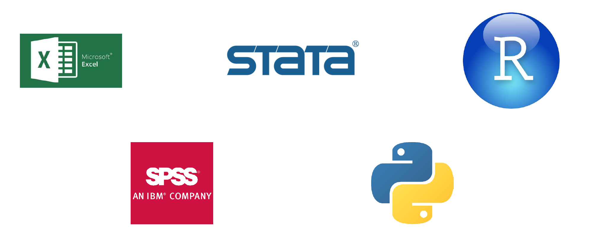
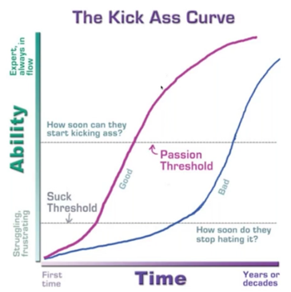
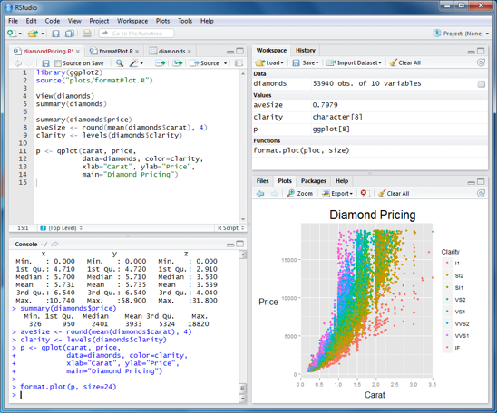

# Equipo Docente

## Profesor {.smaller}

::: columns
::: {.column style="display:inline-block;width:40%;height:60%;border-radius:1em;margin:1%;padding:1.5%;background-color:#ffffff; box-shadow: 0 4px 8px rgba(0,0,0,0.1);"}
<figure style="text-align: center;">
    
    <figcaption style="margin-top: 15px;">
        <strong>Prof.&nbsp;<a href="https://gabrielsotomayorl.github.io/" target="_blank" class="external">Gabriel Sotomayor</a></strong> 
         Profesor de Cátedra
         Universidad Diego Portales
    </figcaption>
</figure>
:::

::: {.column style="width:50%;font-size:1em;margin-left:3%; margin-top:5%;"}
- **Formación:** Sociólogo (Universidad de Chile) y MSc en Sociología (LSE).
- **Experiencia:** Analista en el Observatorio Social del Ministerio de Desarrollo Social (Diseño de encuestas y producción de estadísticas oficiales).
- **Intereses de investigación:** Estratificación, desigualdad y sociología del trabajo.
:::
:::

# Presentación del curso

## ¿De qué trata este curso? {.smaller background-color="white"}

Este curso profundiza en las técnicas de **análisis multivariante**, permitiendo examinar de manera integrada la interacción de múltiples factores en el estudio de problemas sociales. 

::: {.callout-note icon=false title="Enfoque Pedagógico"}
Se enfatiza la **comprensión de los procedimientos** y la **interpretación rigurosa** de los resultados, con un enfoque cien por ciento aplicado mediante el uso de herramientas computacionales, principalmente **R y RStudio**.
:::

El curso prioriza la aplicación práctica de los métodos estadísticos sin requerir una profundización en sus fundamentos matemáticos. Al finalizar, el estudiante será capaz de:

1. Analizar datos primarios y secundarios.  
2. Identificar la técnica estadística adecuada según el contexto.  
3. Generar informes que comuniquen de manera efectiva los hallazgos obtenidos.  

## Resultados de Aprendizaje {background-color="white"}

::: {.callout-tip title="Resultado General"}
Desarrollar la capacidad de aplicar técnicas de estadística multivariante descriptiva e inferencial para **analizar datos, formular hipótesis y construir modelos explicativos** en investigaciones sociales, asegurando la correcta interpretación y comunicación de los resultados.
:::

## Resultados Específicos {.smaller background-color="white"}

Al finalizar el semestre, ustedes serán capaces de:

::: incremental
1. **Gestionar** bases de datos complejas, asegurando su preparación y estructuración para el análisis.
2. **Definir** y estructurar problemas de análisis multivariante, formulando preguntas de investigación con sustento metodológico.
3. **Seleccionar** técnicas estadísticas adecuadas, justificando su aplicación en función del tipo de datos y los objetivos del análisis.
4. **Utilizar** herramientas computacionales especializadas, aplicando modelos en R y RStudio de manera efectiva.
5. **Interpretar** de forma rigurosa los resultados del análisis, identificando sus alcances y limitaciones.
6. **Redactar** informes técnicos y académicos, comunicando los hallazgos de manera clara, estructurada y fundamentada.
:::

# Estructura de Contenidos

## 1 y 2: Gestión y Muestras Complejas {.smaller .dark-background}

::: columns
::: {.column width="50%"}
### 💻 1. Gestión de Datos con R
- Introducción a la manipulación de datos con `tidyverse`.
- Cálculo e interpretación de estadísticos descriptivos.
- Visualización de información con `ggplot2`.
- Elementos introductorios de investigación reproducible.
:::

::: {.column width="50%"}
### 📊 2. Uso de muestras complejas en R
- Conceptos fundamentales de muestreo complejo.
- Diseño de encuestas y aplicación de ponderaciones.
- Inferencia estadística en muestras complejas.
- Manejo de encuestas con los paquetes `survey` y `srvyr`.
:::
:::

## 3 y 4: Modelos y Regresiones {.smaller .dark-background}

::: columns
::: {.column width="50%"}
### 🧠 3. Introducción a Modelos Multivariados
- Rol de los modelos en las ciencias sociales.
- Diferencias entre enfoques exploratorios y confirmatorios.
- Repaso de conceptos estadísticos clave: covarianza, correlación e inferencia.
- Supuestos del análisis multivariante y su importancia.
:::

::: {.column width="50%"}
### 📈 4. Repaso de modelos de regresión
- Relevancia del control estadístico.
- Regresión lineal múltiple.
- Regresión logística binaria.
:::
:::

## 5 y 6: Análisis Factorial {.smaller .dark-background}

::: columns
::: {.column width="50%"}
### 🔍 5. Análisis Factorial Exploratorio (AFE)
- Aplicación en la investigación sociológica.
- Comparación entre componentes principales y factor común; supuestos.
- Extracción de factores, selección y rotación.
- Interpretación de matriz, evaluación del ajuste y puntuaciones.
- Introducción al paquete `psych`.
:::

::: {.column width="50%"}
### 🎯 6. Análisis Factorial Confirmatorio (AFC)
- Diferencias principales con el AFE.
- Especificación e identificación del modelo, estimación de parámetros.
- Evaluación del ajuste, reespecificación y validez.
- Ejemplo práctico de análisis confirmatorio.
- Introducción al paquete `lavaan`.
:::
:::

## 7 y 8: Ecuaciones Estructurales {.smaller .dark-background}

::: columns
::: {.column width="50%"}
### 🛤️ 7. Análisis de Sendero (Path Analysis)
- Fundamentos y aplicación en ciencias sociales.
- Especificación del modelo de sendero y verificación de supuestos.
- Evaluación de la medición y capacidad confirmatoria.
- Ejemplo aplicado en investigación sociológica.
:::

::: {.column width="50%"}
### 🏗️ 8. Modelos de Ecuaciones Estructurales (SEM)
- Definición y aplicación de los SEM en ciencias sociales.
- Estructura del modelo y supuestos de la técnica.
- Estimación, evaluación del modelo y modificaciones.
- Ejemplos de modelamiento en investigación.
:::
:::

## Bibliografía Principal {.smaller background-color="white"}

::: {style="font-size: 1.2rem;"}
| Ítem | Título | Autor | Año |
|:---|:---|:---|:---|
| 1 | Análisis Estadístico Multivariante - Un Enfoque Teórico y Práctico | De La Garza García, J. | 2013 |
| 2 | Análisis de datos multivariantes | Peña, Daniel | 2002 |
| 3 | Análisis Multivariado Aplicado | Uriel y Aldás | 2005 |
| 4 | Análisis Multivariante para las Ciencias Sociales | Levi, J.P. y Varela, J. | 2001 |
| 5 | Modelos de Ecuaciones Estructurales (Cuadernos de estadística) | Batista, J.M. y Coenders, G. | 2012 |
| 6 | Introducción al Análisis de Regresión Lineal | Montgomery, Peck y Vining | 2006 |
| 7 | El análisis factorial como técnica de investigación en Psicología | Ferrando, P. J., & Anguiano-Carrasco, C. | 2010 |
:::

## Bibliografía Complementaria {.smaller background-color="white"}

::: {style="font-size: 1.2rem;"}
| Ítem | Título | Autor | Año |
|:---|:---|:---|:---|
| 8 | Análisis factorial confirmatorio. Su utilidad en la validación de cuestionarios relacionados con la salud. | Batista-Foguet, J.M. et al. | 2004 |
| 9 | El Path Analysis: conceptos básicos y ejemplos de aplicación. | Pérez, E. et al. | 2013 |
| 10 | Modelos de ecuaciones estructurales | Ruiz, M.A | 2010 |
| 11 | RStudio para Estadística Descriptiva en Ciencias Sociales. | Boccardo, G. y Ruiz, F. | 2019 |
| 12 |[R para Ciencia de Datos](https://es.r4ds.hadley.nz/index.html) | Wickham, H | 2019 |
| 13 | Exploring complex survey data analysis using R: A tidy intro with {srvyr} and {survey} | Zimmer, S. A | 2024 |
:::

## Evaluaciones {.smaller .dark-background}

| Evaluación | Fechas (Semana de entrega) | Ponderación |
|:---|:---|:---|
| **Tareas uso de R (4 en total)** | 24 de marzo   28 de abril   2 de junio   16 de junio | **30%** |
| **Prueba Solemne** | 19 de mayo | **35%** |
| **Trabajo Final** | 1 de julio | **35%** |

::: {.callout-important title="¡Fechas Clave!"}
Por favor, agenden desde ya estas fechas en sus calendarios para evitar topes a fin de semestre.
:::

# Apoyo y Logística del Curso

## Ayudantes del Curso {.smaller background-color="white"}

::: columns
::: {.column style="display:inline-block;width:45%;border-radius:1em;margin:1%;padding:1.5%;background-color:#f5f5f5"}
<figure style="text-align: center;">
    
    <figcaption style="margin-top: 10px;">
        <strong>Felipe Adasme</strong>
          Licenciado en Sociología  
        📧 <a href="mailto:felipe.adasme@mail.udp.cl">felipe.adasme@mail.udp.cl</a>
    </figcaption>
</figure>
:::

::: {.column style="display:inline-block;width:45%;border-radius:1em;margin:1%;padding:1.5%;background-color:#f5f5f5"}
<figure style="text-align: center;">
    
    <figcaption style="margin-top: 10px;">
        <strong>Francisca Hernández</strong>
          Licenciada en Sociología  
        📧 <a href="mailto:francisca.hernandez_c@mail.udp.cl">francisca.hernandez_c@mail.udp.cl</a>
    </figcaption>
</figure>
:::
:::

::: {.callout-tip title="Dinámica de las Ayudantías"}
- Están disponibles para responder **dudas teóricas** y **de código en R**.
- Habrá sesiones de ayudantía **cada 2 semanas** aproximadamente, centradas en la aplicación de las técnicas de cátedra.
- Les acompañarán directamente en la realización de tareas y trabajos de investigación.
:::

## Plataformas y Comunicación {.smaller .dark-background}

### 🌐 Página Web del Curso

Todo el material, presentaciones y guías prácticas estarán alojados de manera centralizada en la web del curso. Guarden este enlace en sus favoritos:

::: {.callout-note icon=false}
**[https://gabrielsotomayorl.github.io/aadii/2026/](https://gabrielsotomayorl.github.io/aadii/2026/){preview-link="true"}**
:::

 

### 🗣️ Delegado/a de Curso

Las comunicaciones con el equipo docente para **temas colectivos** deberán gestionarse de manera centralizada mediante un delegado o delegada, especialmente considerando que en la sala hay alumnos de distintas generaciones. 

*Esto es estrictamente necesario y particularmente relevante para solicitudes respecto a fechas de evaluaciones.*

# Introducción a R y Rstudio

## Objetivos de la Sesión 

::: {.callout-note icon=false title="En esta clase buscaremos:"}
1. **Reflexionar** sobre el uso de software estadístico en la investigación en Ciencias Sociales.
2. **Introducir** el ecosistema de R y RStudio: qué son, por qué usarlos y cómo instalarlos.
3. **Comprender** la lógica básica de la programación orientada a objetos y funciones.
:::

## ¿Donde se sitúa la estadística en el proceso de investigación? {background-color="white"}

## Uso de software en ciencias sociales {.smaller background-color="white"}

Progresivamente se ha generalizado el uso de software estadístico en ciencias sociales, abriendo grandes posibilidades de realizar análisis más complejos y facilitando su uso.

::: {.callout-warning title="El riesgo tecnológico"}
Existe el riesgo de una **falta de formación estadística y reflexividad**. Apretar botones sin entender qué hace el software afecta directamente la calidad y validez del análisis.
:::

**Dos niveles de manejo del software:**

1. **Nivel Usuario (Básico):** Ejecución básica y correcta interpretación de las salidas estadísticas. Es el piso mínimo necesario para utilizar la herramienta y comprender investigaciones de terceros.
2. **Nivel Analista (Avanzado):** Manejo avanzado del software y sus procedimientos estadísticos. Es el nivel deseable para un uso reflexivo de las herramientas, personalización de análisis y lectura crítica profunda.

## ¿Qué software existen y cual utilizar? {.smaller background-color="white"}

En el mercado laboral y académico existe una gran variedad de herramientas. La elección dependerá de nuestros objetivos, presupuesto y área de especialización.

## ¿Qué software existen y cual utilizar? {.smaller background-color="white"}

::: {style="font-size: 1.2rem;"}
| Dimensión / Lenguaje | R | Python | SPSS | Excel | Stata |
|:-----------|:-----------|:-----------|:-----------|:-----------|:-----------|
| Alcance | General, orientación multidisciplinar | General, orientación multidisciplinar | Limitado, orientado a Ciencias Sociales | Limitado, orientado a administración | Limitado, orientado a Economía |
| Licencia | Libre (freeware) | Libre (freeware) | Pagada (versión de prueba limitada) | Pagada (versión de prueba limitada) | Pagada (versión de prueba limitada) |
| Aprendizaje | Sintaxis, poco intuitivo | Sintaxis, poco intuitivo | Botones y sintaxis, intuitivo | Botones y sintaxis, intuitivo | Botones y sintaxis, intuitivo |
| Visualización | Avanzada | Intermedia | Básica | Intermedia | Intermedia |
| Análisis de texto | Intermedio, poca eficiencia | Avanzado, amplia eficiencia | No | No | No |
| Minería Datos | Intermedio, poca eficiencia | Avanzado, amplia eficiencia | No | No | No |
| Sistema operativo | Windows, Mac OS, Linux | Windows, Mac OS, Linux | Windows, Mac OS | Windows, Mac OS | Windows, Mac OS |

*Fuente: Boccardo y Ruiz, 2018.*
:::

## ¿Qué es R? {.smaller background-color="white"}

**R** es un software y un lenguaje de programación de código abierto (libre), enfocado principalmente en el análisis estadístico y la visualización de datos.

*   **Lógica de trabajo:** Funciona mediante **objetos**, sobre los cuales aplicamos operadores y **funciones**.
*   **Lenguaje de programación:** Al no ser solo un programa cerrado, podemos crear nuestras propias funciones. *Pasamos de ser simples usuarios a programadores.*
*   **Modularidad:** Instalamos una versión base y luego la expandimos agregando **paquetes** (librerías) creados por la comunidad.

::: {.callout-important title="El problema"}
Su interfaz nativa es muy poco amigable, parece una simple calculadora de texto. **La solución a esto es RStudio.**
:::

## ¿Qué es R? {.smaller background-color="white"}

{fig-align="center"}

## ¿Por qué aprender y usar R? {.smaller background-color="white"}

::::: columns
::: {.column width="50%"}
{fig-align="center"}
:::
::: {.column width="50%"}
{fig-align="center"}
:::
:::::

## Razones prácticas para usar R {.smaller background-color="white"}

1. **Es libre y gratis:** No dependes de las licencias de la universidad o de tu futuro empleador.
2. **Personalización y vanguardia:** Ofrece posibilidades ilimitadas para personalizar análisis. Las nuevas técnicas estadísticas llegan primero a R antes que al software comercial.
3. **Comunidad:** Existe una gigantesca y creciente comunidad de usuarios desarrollando funciones y resolviendo dudas en foros de internet (la gran mayoría del soporte está en inglés).
4. **Sintaxis moderna:** Con paquetes recientes (como `tidyverse`), su sintaxis se ha vuelto mucho más simple e intuitiva de leer.

## ¿Por qué trabajar con código y no con botones? {.smaller background-color="white"}

Aprender código puede parecer contraintuitivo y frustrante al principio, pero tiene tres ventajas innegables:

* 🔍 **Replicabilidad:** Permite a otros (y a ti mismo en el futuro) entender paso a paso cómo construiste tus resultados y replicarlos. Hoy esto es una exigencia básica en la ciencia de calidad.
* 🚀 **Eficiencia:** En condiciones "reales" de trabajo (bases de datos grandes, tareas repetitivas), un *script* de código es infinitamente más rápido que hacer cientos de clics.
* 🧠 **Control total:** Tienes claridad absoluta de todas las etapas del análisis. En programas de botones, muchas decisiones metodológicas se toman "por defecto" sin que el investigador se dé cuenta.

*(Elousa, 2009 en Boccardo y Ruiz, 2018: 8-9)*

## ¿Qué es RStudio? {.smaller background-color="white"}

Es un **Entorno de Desarrollo Integrado (IDE)**. En palabras simples: es una interfaz gráfica que "envuelve" a R para hacernos la vida mucho más fácil.

**Se divide en 4 paneles principales:**

1. **Editor de código (Script):** El bloc de notas donde escribimos, guardamos y ejecutamos nuestro código.
2. **Ambiente de trabajo (Environment):** Muestra todas las bases de datos y objetos que tenemos cargados en la memoria RAM temporal.
3. **Consola (Console):** El "motor" de R. Aquí vemos los resultados numéricos, la ejecución paso a paso y las advertencias o errores.
4. **Panel multipropósito:** Contiene los gráficos (*Plots*), los paquetes instalados (*Packages*), la ayuda (*Help*) y el explorador de archivos (*Files*).

## ¿Qué es RStudio? {.smaller background-color="white"}

{fig-align="center"}

## Instalación: Paso 1, Instalar R {.smaller background-color="white"}

::::: columns
::: {.column width="60%"}
::: {.callout-tip title="Regla de oro"}
**Siempre** se debe instalar R primero, y RStudio después.
:::

Podemos encontrar el instalador de R para Windows, Linux y Mac en el sitio oficial del CRAN:  
🔗 [https://cloud.r-project.org/](https://cloud.r-project.org/){preview-link="true"}

**Instrucciones:**
Debemos descargar el "paquete base" (base R), luego ejecutar el archivo descargado e instalarlo dándole "Siguiente" a todas las opciones predeterminadas.
:::

::: {.column width="40%"}
{fig-align="center"}
:::
:::::

## Instalación: Paso 2, Instalar RStudio {.smaller background-color="white"}

::::: columns
::: {.column width="60%"}
Una vez que R ya está en nuestro computador, procedemos a instalar la interfaz.

Podemos encontrar RStudio en su sitio web. Debemos descargar la **versión gratis (RStudio Desktop)**, que es totalmente funcional para nuestros propósitos:  
🔗[https://posit.co/download/rstudio-desktop/](https://posit.co/download/rstudio-desktop/){preview-link="true"} *(Nota: RStudio ahora es parte de la empresa Posit).*

Debemos fijarnos en elegir el instalador correcto para nuestro sistema operativo (Windows o Mac). Igualmente, lo instalamos usando las opciones predeterminadas.
:::

::: {.column width="40%"}
{fig-align="center"}
:::
:::::

## Advertencia: El problema de Java x64 {.smaller background-color="white"}

::: {.callout-warning title="Atención usuarios de Windows"}
Para algunos análisis específicos (o al leer ciertos archivos de Excel viejos), R utiliza el software Java. El problema es que los computadores suelen tener instalada la versión antigua de 32 bits, mientras que RStudio opera en **64 bits**. Esto genera un error de incompatibilidad.
:::

**¿Cómo resolverlo?**
Si te encuentras con este error en el futuro, debes descargar e instalar la versión **offline de 64 bits** de Java desde su página oficial:  
🔗[https://www.java.com/es/download/manual.jsp](https://www.java.com/es/download/manual.jsp){preview-link="true"}

{fig-align="center" width="60%"}

## Programación por objetos y funciones {.smaller background-color="white"}

**Tipos de estructuras de datos en R**

*Vector (vector)*: columna o fila de datos de un mismo tipo (una variable individual)

*Listas (list)*: Nos permiten agrupar objetos de distinto tipo.

*Matrices (matrix)*: arreglo de dos dimensiones de datos de un mismo tipo (conjunto de variables)

*Data.frame (base de datos)*: Matriz de datos en el que las columnas tienen asignado nombres, y que permite usar todo tipo de datos.

## Conceptos clave: Estructuras de datos {.smaller background-color="white"}

R organiza la información en diferentes "envases". Los principales son:

*   `Vector` **(Vector):** Una columna o fila de datos de un mismo tipo. Es la estructura más básica (equivale a *una variable individual*).
*   `List` **(Listas):** Cajas complejas que nos permiten agrupar múltiples objetos que pueden ser de distinto tamaño o tipo.
*   `Matrix` **(Matrices):** Arreglo de dos dimensiones (filas y columnas) donde **todos** los datos deben ser exactamente del mismo tipo (por ejemplo, solo números).
*   `Data.frame` **(Base de datos):** Es la estructura reina en Ciencias Sociales. Es una matriz de datos bidimensional donde cada columna tiene un nombre (variable) y cada fila es un caso. A diferencia de la matriz, **permite combinar distintos tipos de datos** (una columna de texto, otra de números, etc.).

## Conceptos clave: Tipos de variables {.smaller background-color="white"}

Dentro de las estructuras (como un vector o una columna de un data.frame), los datos pueden tener distintas naturalezas:

::: {style="font-size: 1.4rem;"}
| Tipo en R | Descripción | Ejemplo |
|:---|:---|:---|
| `numeric` | Números (pueden contener decimales) | 1.5, 3.14, 100 |
| `integer` | Números enteros estrictos | 1, 2, 3 |
| `logical` | Valores booleanos | `TRUE` (Verdadero) o `FALSE` (Falso) |
| `character` / `string` | Cadenas de texto. Siempre van entre comillas | `"Santiago"`, `"Femenino"` |
| `factor` | Variables categóricas/nominales. Tienen "niveles" subyacentes | Nivel 1: `"Bajo"`, Nivel 2: `"Alto"` |
:::

{fig-align="center" width="50%"}

## ¿Cómo sobrevivir y continuar aprendiendo? {.smaller background-color="white"}

Dominar R es un camino de mediano plazo. Es normal que el código arroje error (¡le pasa a los expertos todos los días!). Lo importante es desarrollar **habilidad de “hacking”**:  

1. No frustrarse ante el error en rojo.  
2. Estar dispuesto a buscar respuestas de manera autónoma.  
3. Saber dónde buscar la información.  

::: {.callout-tip title="Tus mejores aliados para buscar ayuda"}
- **¡GOOGLE!** (Preferentemente busca en inglés, ej: *"how to filter rows in R dplyr"*).
- La pestaña **Help** dentro de RStudio (escribiendo `?nombrefuncion`).
- Foros como [StackOverflow](https://stackoverflow.com/){preview-link="true"}.
- **Inteligencia Artificial (ChatGPT, Claude, Gemini):** Son excelentes tutores de R. *Tip: Cópiales tu código, diles qué intentas hacer y pégales el mensaje de error exacto que te dio R.*
:::

## Bibliografía y recursos recomendados {.smaller background-color="white"}

**Textos base:**

* Boccardo, G. y Ruiz, F. (2018). *Uso de RStudio para Estadística Univariada en Ciencias Sociales*. Universidad de Chile. [Enlace al documento]
* Wickham, H. y Grolemund, G. (2019). *R para Ciencia de Datos*.[https://es.r4ds.hadley.nz/](https://es.r4ds.hadley.nz/){preview-link="true"}
* Paradis, E. (2003). *R para Principiantes*. [Enlace PDF CRAN](https://cran.r-project.org/doc/contrib/rdebuts_es.pdf){preview-link="true"}

**Sitios web útiles:**

* [http://www.sthda.com](http://www.sthda.com) (Excelente para visualización y estadística).

**Cursos online (Inglés):**

* Especialización en Data Science, Johns Hopkins (Coursera): [Enlace](https://www.coursera.org/specializations/jhu-data-science)
* DataCamp (Módulos de R): [Enlace](https://www.datacamp.com/courses/tech:r)