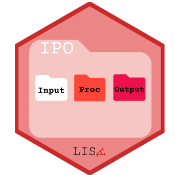
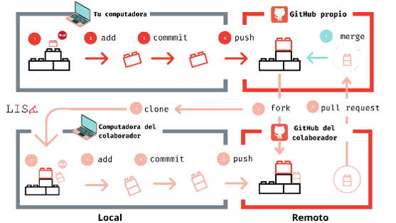

## Objetivos de la sesión

::: {.callout-note icon=false title="En esta clase buscaremos:"}
1. **Introducir** la importancia de la reproducibilidad en la investigación científica.
2. **Comprender** el concepto de ciencia abierta y sus componentes principales.
3. **Conocer** herramientas y protocolos para organizar proyectos reproducibles en R.
:::

# Reproducibilidad

## Replicación y reproducibilidad {.smaller}

Dos conceptos relacionados pero distintos:

::: {style="font-size: 1.3rem;"}
| | Definición | Pregunta |
|:---|:---|:---|
| **Replicación** | Nuevo estudio independiente: nuevos investigadores, nuevos datos, nuevos procedimientos | ¿Se llega a las mismas conclusiones? |
| **Reproducibilidad** | Mismo estudio: mismos datos + mismo código | ¿Se obtienen los mismos resultados? |
:::

La replicación es el estándar ideal, pero no siempre es posible (costos, tiempo, eventos únicos). La **reproducibilidad** es el estándar mínimo exigible: dejar disponibles los datos y el código para que cualquiera pueda verificar los resultados. Especialmente crítico cuando el conocimiento afecta **decisiones de política pública**.

## ¿Por qué es importante la reproducibilidad? {.smaller}

-   **Validez y Confianza**: Refuerza la credibilidad de la investigación al permitir la verificación independiente de los hallazgos.
-   **Transparencia**: Aumenta la transparencia del proceso de investigación, facilitando la detección de errores y sesgos.
-   **Acumulación de Conocimiento**: Permite construir sobre investigaciones anteriores de manera más sólida y eficiente.
-   **Responsabilidad y Ética**: Aumenta la responsabilidad de los investigadores y promueve prácticas éticas en la producción de conocimiento.
-   **Para evitar el caos**: Organizar el trabajo de manera sistemática, facilitando la gestión de proyectos a largo plazo y en equipo.

## Crisis de replicación {.smaller}

Actualmente existen iniciativas destinadas a replicar (o reproducir) estudios científicos publicados, lo cual ha dado cuenta de la imposibilidad de hacerlo fruto de la falta de documentación, datos, o incluso debido a investigadores llegando a resultados diferentes utilizando los mismos datos.

Esto hace relevante avanzar en mayor **transparencia** en todas las etapas del proceso de investigación.

# Ciencia abierta

## Ciencia abierta {.smaller}

La investigación reproducible puede pensarse como parte de un marco más amplio: **la ciencia abierta**.

Esto puede pensarse en todas las etapas del proceso de producción de conocimiento:

-   Diseño de investigación  
-   Producción de datos  
-   Análisis de datos  
-   Publicación

Basado en la perspectiva de ciencia abierta elaborada por **LISA-COES**:

::: {style="text-align: center;"}
{width=55%}
:::

## Diseño transparente {.smaller}

Refiere a contar con estándares de transparencia en la realización de estudios que permitan una mejor evaluación de pares.

Esto es fundamental para evitar malas prácticas como el **p-hacking** o el **HARKing** (*Hypothesizing After Results are Known*: construir hipótesis a posteriori de los resultados). La principal herramienta son los **pre-registros**.

El pre-registro consiste en publicar (previo a la realización del estudio) 1) las principales hipótesis, 2) los procedimientos de recolección de datos y 3) el plan de análisis.

No siempre es posible diseñar a priori o prever todos los elementos de nuestro análisis: lo importante del pre-registro es que permite distinguir lo que corresponde al plan original y transparentar aquello que emergió posteriormente.

## Datos abiertos {.smaller}

Los datos a partir de los cuales produzcamos nuestros resultados —ya sean encuestas, datos administrativos o indicadores— deben estar públicamente disponibles. No basta con publicarlos: necesitamos información que permita su correcta utilización.

Para esto necesitamos dejar públicamente disponible cuatro elementos:

1. Base de datos
2. Cuestionario
3. Libro de códigos
4. Ficha técnica

## Análisis reproducibles {.smaller}

Se trata de organizar nuestro análisis de tal manera que sea posible para otros/as investigadores/as reproducir los análisis que realizamos, llegando a los resultados publicados. Esto permite conocer todas las decisiones tomadas, y nos obliga a mantener un flujo de trabajo más sistemático.

Los pasos a seguir, o elementos a considerar, (en los que profundizaremos luego) son:

1. La estructura del proyecto
2. Prácticas de código
3. Documentos dinámicos
4. Control de versiones

## Regla de oro de la reproducibilidad {.center}

::: {.center .smaller style="background-color: #fdf2f2; border: 2px solid #e74c3c; border-radius: 8px; padding: 1em; color: #e74c3c;"}
**TODO DEBE DESARROLLARSE EN EL SCRIPT**
:::

## Publicaciones libres {.smaller}

Se trata de eliminar las barreras (especialmente económicas) al conocimiento.

El modelo de negocio de las editoriales académicas genera barreras de acceso al conocimiento que es mayoritariamente financiado con fondos públicos.

Es posible encontrar revistas que cuentan con acceso abierto. Para saber el nivel de apertura de una revista puede encontrarse en <https://openpolicyfinder.jisc.ac.uk/>.

En general, es importante considerar que esto no depende solo de la iniciativa individual, sino también de las instituciones científicas existentes.

## ¿Por qué es importante esto más allá de la academia? {.smaller}

En primer lugar resulta importante para asegurar la transparencia de la producción científica, haciendo más posible el control público de las decisiones que se toman basadas en el conocimiento producido.

Para nuestra labor como sociólogos, el trabajo con estándares de reproducibilidad nos permite mantener mayor control de lo que hacemos, mejora su comunicabilidad y en entornos institucionales (e individualmente) permite mantener mejores registros en el tiempo.

En términos simples, **nos permite evitar el caos** en nuestro trabajo.

# Herramientas para la reproducibilidad

## Programación literada {.smaller}

Una herramienta central para hacer reportes reproducibles es la **programación literada**: documentos que integran lenguaje humano (prosa) con lenguaje computacional (código ejecutable) en un mismo archivo.

Existen múltiples herramientas para esto: Jupyter Notebooks (Python), R Markdown (R) y **Quarto** (multilenguaje). En este curso utilizamos **Quarto**.

**Quarto** es el sistema de publicación científica y técnica de código abierto desarrollado por Posit. Permite combinar texto en Markdown con código R en un mismo documento `.qmd`, generando reportes reproducibles en formatos HTML, PDF, Word, presentaciones y más.

## Quarto: Sintaxis de texto {.smaller}

::::: columns
::: {.column width="52%"}

**Código Markdown (lo que escribes):**

````{.markdown}
*Cursiva* y **Negrita**

## Título secundario
### Título terciario

- Primer ítem
- Segundo ítem

1. Lista numerada
2. Segundo elemento

El promedio es `r mean(c(1, 2, 3))`

[Texto del enlace](https://url.cl)
````

::: {.callout-tip icon=false title="💡 Salto de línea"}
Terminar con **dos espacios** o dejar una línea en blanco entre párrafos.
:::

:::
::: {.column width="48%"}

**Resultado (lo que se renderiza):**

*Cursiva* y **Negrita**

#### Título secundario
##### Título terciario

- Primer ítem
- Segundo ítem

1. Lista numerada
2. Segundo elemento

El promedio es **2**

[Texto del enlace](#)

:::
:::::

## Quarto: Bloques de código {.smaller}

::::: columns
::: {.column width="50%"}

**Sintaxis de un chunk:**

````{verbatim}
```{r}
#| label: mi-analisis
#| echo: true
#| fig-height: 4

x <- c(1, 2, 5, 78, 87, 4, 3)
mean(x)
```
````

- Abre con ` ```{r} ` y cierra con ` ``` `
- Las opciones `#|` van al inicio del chunk
- `{r}` indica el lenguaje (puede ser `{python}`, `{stata}`...)

:::
::: {.column width="50%"}

**Opciones `#|` principales:**

| Opción | Efecto |
|:---|:---|
| `echo: true/false` | Mostrar u ocultar código |
| `eval: true/false` | Ejecutar o no |
| `include: false` | Ocultar código y resultado |
| `warning: false` | Suprimir advertencias |
| `fig-height` / `fig-width` | Tamaño del gráfico |
| `cache: true` | Guardar resultado en caché |

::: {.callout-important icon=false title="La ventaja clave"}
Al cambiar los datos, **todo se recalcula automáticamente**. No más copiar y pegar resultados a mano.
:::

:::
:::::

## Quarto en acción {.smaller}

Al renderizar, el código R **se ejecuta** y los resultados quedan incrustados automáticamente:

```{r}
#| echo: true
#| fig-height: 3.2
#| fig-width: 9

edades <- c(18, 25, 33, 38, 67, 25, 35, 57, 42, 29, 44, 51)
cat("Promedio:", round(mean(edades), 1),
    "| Mediana:", median(edades),
    "| N:", length(edades))

hist(edades,
     main   = "Distribución de edades (demo reproducible)",
     xlab   = "Edad",
     ylab   = "Frecuencia",
     col    = "#1a365d",
     border = "white")
```

## Buenas prácticas de código {.smaller}


## Protocolos de reproducibilidad {.smaller}

::::: columns
::: {.column width="80%"}

Para hacer nuestro proyecto de investigación reproducible no solo importa el código, también requerimos que el proyecto este estructurado de manera reproducible, para lo cual existen protocolos. En este caso revisaremos el protocolo IPO (Input-Procesamiento - Output). Esto puede realizarse con R Projects.

"La implementación de la reproducibilidad en este tipo de protocolos se basa en generar un conjunto de archivos auto-contenidos organizado en una estructura de proyecto que cualquier persona pueda compartir y ejecutar. En otras palabras, debe tener todo lo que necesita para ejecutar y volver a ejecutar el análisis."

:::
::: {.column width="20%"}



:::
:::::

## El Protocolo IPO para Proyectos Reproducibles {.smaller}

-   **IPO (Input-Procesamiento-Output)**: Un modelo mental simple para organizar el flujo de trabajo de investigación.
-   **Basado en TIER**: Inspirado en el protocolo TIER (Integridad de Enseñanza en Investigación Empírica) para la transparencia.
-   **Memorizable y Práctico**: Fácil de recordar y aplicar en la práctica diaria del análisis de datos.
-   **Auto-Contenido**: Busca crear proyectos que contengan todo lo necesario para ser ejecutados y reproducidos por otros.

::: {style="font-size: 0.85rem; color: #555; margin-top: 1em;"}
Basado en el protocolo de [LISA-COES](https://lisa-coes.netlify.app/ipo-repro/)
:::

## Estructura de Carpetas IPO {.smaller}

```         
├── input/         # Información externa
│   ├── data/
│   │   ├── original/   # Datos originales (sin modificar)
│   │   └── proc/       # Datos procesados (limpios, transformados)
│   ├── imagenes/     # Imágenes externas para el proyecto
│   ├── bib/          # Archivos de bibliografía (.bib)
│   └── prereg/       # Pre-registros del estudio (si existen)
├── procesamiento/  # Scripts de análisis y preparación
│   ├── preparacion.qmd   # Script de preparación de datos
│   └── analisis.qmd      # Script de análisis principal
├── output/        # Resultados del procesamiento
│   ├── graphs/     # Gráficos generados
│   └── tables/     # Tablas generadas
├── readme.md      # Descripción general del proyecto
└── paper.qmd      # Documento principal (paper, reporte)
```

## Carpetas IPO en Detalle: Input {.smaller}

-   **`input/`**: Todo lo que "entra" al proyecto desde fuera.
    -   **`data/original/`**: **Datos crudos, sin tocar**. Archivos originales tal como se obtuvieron. **¡Solo lectura!**
    -   **`data/proc/`**: **Datos procesados y limpios**. Resultado de los scripts de preparación. Listos para el análisis.
    -   **`imagenes/`**: Logos, fotos, diagramas... Cualquier imagen externa usada en el proyecto.
    -   **`bib/`**: Archivos `.bib` para la gestión de bibliografía con herramientas como BibTeX o Zotero.
    -   **`prereg/`**: Pre-registros del estudio, si se realizaron (documentos de registro de hipótesis, métodos, etc.).

## Carpetas IPO en Detalle: Procesamiento y Output {.smaller}

-   **`procesamiento/`**: El "corazón" del análisis.
    -   **`preparacion.qmd`**: Script Quarto para la limpieza, transformación y preparación de los datos crudos (`input/data/original/`) para el análisis. **Genera los datos procesados en `input/data/proc/`**.
    -   **`analisis.qmd`**: Script Quarto con el análisis principal. **Utiliza los datos procesados (`input/data/proc/`) y genera resultados en `output/`**.
-   **`output/`**: Los "productos" del análisis.
    -   **`graphs/`**: Gráficos generados por los scripts de análisis.
    -   **`tables/`**: Tablas de resultados, resúmenes, etc., generadas por los scripts.
    -   **¡Todo en `output/` debe ser regenerable ejecutando los scripts en `procesamiento/`!**

## Archivos Clave en la Raíz del Proyecto IPO {.smaller}

-   **`readme.md`**: **La "carta de presentación" del proyecto**.
    -   Explica **qué** es el proyecto, **cómo** está organizado (estructura IPO), **cómo reproducirlo**, dependencias, etc.
    -   Primer archivo que alguien debería leer al abrir el proyecto.
-   **`paper.qmd` (o `.html`, `.pdf`)**: **El documento principal**.
    -   Puede ser un paper, un reporte, una presentación...
    -   **Integra el código de análisis, los resultados (de `output/`) y la narrativa** en un documento dinámico y reproducible.
    -   Idealmente, utiliza Quarto para la máxima flexibilidad.

## Flujo de Trabajo IPO: Principios Clave {.smaller}

-   **Orden ante todo**: Diseña el proyecto pensando en que alguien (¡o tu "yo" del futuro!) pueda entenderlo y reproducirlo fácilmente.
-   **Comentar el código**: Explica las decisiones importantes en el código. ¿Por qué haces esto? ¿Qué significa esta transformación?
-   **Preparación primero**: El script `preparacion.qmd` debe:
    1.  **Cargar datos originales** (`input/data/original/`).
    2.  **Realizar limpieza y transformaciones**.
    3.  **Guardar datos procesados** en `input/data/proc/`.
-   **Análisis después**: El script `analisis.qmd` debe:
    1.  **Cargar datos procesados** (`input/data/proc/`).
    2.  **Realizar el análisis estadístico**.
    3.  **Guardar tablas y gráficos** en `output/graphs/` y `output/tables/`.

## RProject y Rutas Relativas: Claves de la Portabilidad {.smaller}

::: {style="font-size: 1.5rem;"}
-   **RProject (.Rproj)**: Convierte la carpeta del proyecto en un proyecto de RStudio.
    -   **Directorio de trabajo automático**: La raíz del proyecto es siempre el directorio de trabajo. **¡No uses `setwd()`!**
    -   **Facilita rutas relativas**: Permite usar rutas relativas a la raíz del proyecto, haciendo el proyecto portable.
-   **Rutas Relativas**: Describen la ubicación de un archivo **en relación con la ubicación actual** (la raíz del proyecto en RProject).
    -   **`../`**: "Un nivel arriba" en la jerarquía de carpetas.
    -   **`input/data/original/data.csv`**: Desde la raíz, entra en `input/`, luego `data/`, luego `original/`, y encuentra `data.csv`.
    -   **Ejemplo en `preparacion.qmd` (dentro de `procesamiento/`) para cargar datos originales**: `read.csv(here::here("input", "data", "original", "data.csv"))` (usando el paquete `here`).
::: 


## Control de versiones/GitHub {.smaller}

::::: columns
::: {.column width="60%"}

El control de versiones consiste en tener un sistema que nos permita mantener registro de los cambios realizados a los archivos de un proyecto (qué, quién y cuándo).

Git es una herramienta de código abierto que nos permite realizar control de versiones.

GitHub es una plataforma de desarrollo colaborativo que nos permite usar repositorios locales y remotos.

:::
::: {.column width="40%"}



:::
:::::

## Checklist de la investigación reproducible {.smaller}

-   Empezar con buena ciencia
-   NO hacer cosas a mano
-   NO hacer cosas con clics
-   Enseñar al computador (automatizar)
-   Usar control de versiones
-   Mantener registro del ambiente de software
-   NO guardar los output (guardar los datos y el código)
-   Establecer una semilla aleatoria
-   Pensar en el proceso completo (datos brutos → datos procesados → análisis → reporte)
