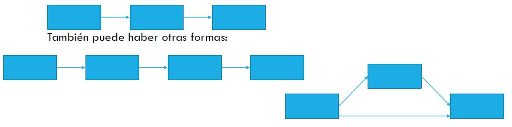

## Contenidos de esta Sesión {.smaller}

**Análisis de Senderos (Parte II)**

*   Recordatorio de la sesión anterior: Conceptos básicos y supuestos del PA.
*   **Pasos de aplicación del PA:**
    *   Especificación del modelo.
    *   Identificación del modelo.
    *   Estimación de parámetros.
    *   Evaluación del ajuste del modelo.
    *   Re-especificación del modelo (si es necesario).
    *   Interpretación de resultados.
*   **Aplicación Práctica de PA en R** (con `lavaan`).

---
title_slide_background: "#008080"
---

# 1. Repaso de la Sesión Anterior: Fundamentos del PA

## Conceptos Centrales del Análisis de Senderos (Repaso) {.smaller}

*   **Análisis de Senderos (PA):** Técnica para evaluar el ajuste de **modelos teóricos** que proponen relaciones de dependencia (causales hipotetizadas) entre **variables observadas**. Es una extensión de la Regresión Lineal Múltiple (RLM).
*   **Variables Exógenas:** Sus causas están *fuera* del modelo; explican a otras variables.
*   **Variables Endógenas:** Sus causas están *dentro* del modelo; son explicadas por otras variables (pueden ser dependientes finales o mediadoras).
*   **Efectos Directos:** Influencia inmediata de una variable X sobre una variable Y (X $\longrightarrow$ Y).
*   **Efectos Indirectos:** Influencia de X sobre Y que opera *a través* de una o más variables mediadoras (X $\longrightarrow$ M $\longrightarrow$ Y).
*   **Efectos Espurios:** Parte de la correlación entre dos variables endógenas que se debe a una causa exógena común.

## Supuestos Clave del Path Analysis (Repaso) {.smaller}

Recordemos los supuestos importantes que discutimos:

*   **Correcta Especificación del Modelo** (basada en teoría).
*   **Exploración y Limpieza de Datos** (outliers, missing values).
*   **Tamaño Muestral Adecuado** (ej. ~10-20 casos/parámetro, N > 200).
*   **Independencia de los Errores** (residuales de cada ecuación).
*   **Normalidad** (de residuos/variables, especialmente para estimación ML).
*   **Linealidad y Aditividad** de las relaciones.
*   **Baja Multicolinealidad** entre predictores de una misma endógena.
*   **Recursividad** (generalmente, modelos sin loops causales).
*   **Nivel de Medición** (idealmente intervalar, o manejo adecuado de ordinales).
*   **Confiabilidad de las Medidas** (variables observadas miden bien sus conceptos).

---
title_slide_background: "#008080"
---

# 2. Pasos de Aplicación del Análisis de Senderos

## Los 6 Pasos del Path Analysis {.smaller}

La aplicación de un Análisis de Senderos sigue una secuencia lógica:

1.  **Especificación del Modelo:**
    *   Traducir la teoría en un diagrama de senderos y/o un sistema de ecuaciones. Definir qué variables se relacionan y en qué dirección.
2.  **Identificación del Modelo:**
    *   Asegurar que el modelo propuesto pueda ser estimado unívocamente con los datos disponibles. (¿Hay suficiente información para calcular todos los parámetros?).
3.  **Estimación de Parámetros:**
    *   Calcular los coeficientes path (fuerza de las relaciones), varianzas y covarianzas, usando un método de estimación apropiado (ej. Máxima Verosimilitud).
    
## Los 6 Pasos del Path Analysis {.smaller}

4.  **Evaluación del Ajuste del Modelo:**
    *   Determinar qué tan bien el modelo teórico reproduce las relaciones (covarianzas/correlaciones) observadas en los datos empíricos, usando índices de bondad de ajuste.
5.  **Re-especificación del Modelo (si es necesario):**
    *   Si el ajuste es pobre, considerar modificaciones al modelo (añadir/quitar paths), *siempre con justificación teórica*.
6.  **Interpretación de Resultados:**
    *   Extraer conclusiones sobre las hipótesis, la magnitud y significancia de los efectos, y la validez general del modelo.

## Paso 1: Especificación del Modelo {.smaller}  

<div style="font-size: 0.9em; line-height: 1.2;"> 
Este paso se define a partir de la teoría.

*   **Base Teórica:** Se parte del conocimiento disponible sobre el fenómeno social que se quiere modelar. ¿Qué dice la literatura previa? ¿Cuáles son las hipótesis causales?
*   **Selección de Variables:** Elegir las variables observables relevantes que representan los conceptos teóricos.
*   **Definición de Relaciones:** Establecer las **direcciones de influencia** (qué variable afecta a cuál) y qué relaciones se esperan (positivas, negativas).
*   **Errores de Especificación a Evitar:**
    *   **Interna:** Omitir paths importantes que la teoría sugiere, o incluir paths irrelevantes sin sustento.
    *   **Externa:** Omitir variables exógenas relevantes que podrían explicar variación o generar relaciones espurias.
*   *Ejemplo:* Si modelamos el rendimiento académico, la teoría podría sugerir que la autoeficacia (variable mediadora) conecta el apoyo familiar (exógena) con el rendimiento (endógena final). Omitir la autoeficacia sería un error de especificación.
</div>
 
 
## Paso 2: Identificación del Modelo {.smaller}
<div style="font-size: 0.8em; line-height: 1.2;"> 
Un modelo debe ser **identificado** para que sus parámetros puedan ser estimados de forma única.

*   **Información Disponible vs. Parámetros a Estimar:**
    *   La "información disponible" son las **varianzas y covarianzas únicas** entre las variables observadas en nuestros datos. Para *p* variables, hay $p(p+1)/2$ de estas piezas de información.
    *   Los "parámetros a estimar" son todos los coeficientes path, las varianzas de las variables exógenas, las varianzas de los términos de error de las endógenas, y las covarianzas entre exógenas (si se modelan).
*   **Grados de Libertad (gl):**
    *   $gl = (\text{Nº de varianzas/covarianzas únicas}) - (\text{Nº de parámetros libres a estimar})$
*   **Estados del Modelo:**
    *   **Sub-identificado ($gl < 0$):** Hay más parámetros que información. Infinitas soluciones. **No se puede estimar.** Se necesita simplificar el modelo o añadir restricciones.
    *   **Justo-identificado ($gl = 0$):** Hay tantos parámetros como piezas de información. El modelo reproducirá las covarianzas observadas. **No se puede testear la teoría**, ya que no hay "espacio" para el error.
    *   **Sobre-identificado ($gl > 0$):** Hay más piezas de información que parámetros. Hay una solución única y el modelo **puede ser testeado** contra los datos. Este estado permite evaluar el ajuste.
</div>
## Paso 3: Estimación de Parámetros {.smaller}
<div style="font-size: 0.9em; line-height: 1.2;"> 
Una vez especificado e identificado el modelo, se estiman los parámetros.

*   **Objetivo:** Encontrar los valores de los coeficientes path (y otras varianzas/covarianzas) que hagan que la **matriz de covarianza implicada por el modelo** ($\Sigma(\theta)$) sea lo más parecida posible a la **matriz de covarianza observada en la muestra (S)**.
*   **Matriz Residual:** $S - \Sigma(\theta)$. Si el modelo ajusta bien, esta matriz debería tener valores cercanos a cero.
*   **Métodos de Estimación Comunes:**
    *   **Máxima Verosimilitud (Maximum Likelihood - ML):** El estándar tradicional. Asume normalidad multivariante.
    *   **ML Robusto (MLR):** Opción habitual para variables **continuas** que violan la normalidad. Aplica correcciones robustas (Satorra-Bentler) a los errores estándar y al estadístico $\chi^2$.
    *   **DWLS / WLSMV:** Estimador para variables ordinales/categóricas.
</div>
## Paso 4: Evaluación del Ajuste del Modelo {.smaller}
<div style="font-size: 0.8em; line-height: 1.2;"> 
¿Qué tan bien nuestro modelo teórico representa los datos empíricos? Usamos **índices de bondad de ajuste**.

*   **Lógica:** Comparan la matriz de covarianza observada (S) con la matriz de covarianza que el modelo *implica* o *reproduce* ($\hat{\Sigma}$ o $\Sigma(\theta)$).
*   Se evalúa el ajuste en tres niveles:
    1.  **Ajuste Global del Modelo:** ¿El modelo en su conjunto es consistente con los datos?
    2.  **Ajuste de Partes del Modelo:** ¿Hay relaciones específicas mal representadas (residuos grandes)?
    3.  **Magnitud y Significancia de Parámetros:** ¿Los coeficientes path son sustantivos y estadísticamente significativos? ¿La varianza explicada ($R^2$) de las endógenas es aceptable?
*   **Tipos de Índices de Ajuste Global:**
    *   **Absolutos:** Evalúan el ajuste sin comparar con un modelo base (ej. $\chi^2$, RMSEA).
    *   **Incrementales/Comparativos:** Comparan el modelo propuesto con un modelo más restrictivo, usualmente el "modelo nulo" o de independencia (ej. CFI, TLI).
    *   **De comparación:** Consideran ajuste y complejidad del modelo (ej. AIC, BIC).
</div>
## Evaluación del Ajuste: Criterios Comunes {.smaller}

<div style="font-size: 0.72em; line-height: 1.18;"> 
| Estadístico | Abreviatura | Uso e interpretación |
| :--- | :--- | :--- |
| Chi-cuadrado del modelo | $\chi^2$ | Evalúa discrepancia global; con N grande suele ser significativo. |
| Razón chi-cuadrado / grados de libertad | $\chi^2/gl$ | Regla descriptiva: < 2-3 suele leerse como buen ajuste; < 5 como aceptable. |
| Error de aproximación | RMSEA | $\leq$ 0.05 buen ajuste; $\leq$ 0.08 aceptable. Revisar también su IC 90%. |
| Ajuste comparativo | CFI | $\geq$ 0.95 buen ajuste; $\geq$ 0.90 aceptable. |
| Ajuste comparativo con penalización por complejidad | TLI | $\geq$ 0.95 buen ajuste; $\geq$ 0.90 aceptable. |
| Criterio de información de Akaike | AIC | Útil para comparar modelos; valores más bajos indican mejor balance ajuste/complejidad. |
| Criterio de información bayesiano | BIC | Útil para comparar modelos; penaliza más la complejidad que AIC. |
</div>  


## Paso 5: Re-especificación del Modelo {.smaller}

*   Si el ajuste del modelo inicial no es satisfactorio, se puede considerar **modificarlo (re-especificarlo)**.
*   **Cautela:** La re-especificación debe tener justificación teórica. Añadir o quitar paths solo para "mejorar los números" puede producir modelos que ajustan bien a la muestra particular por azar, pero no generalizan (sobreajuste).
*   **Herramientas para guiar la re-especificación (con cautela):**
    *   **Índices de Modificación (IM):** Sugieren qué parámetro, si se liberara (se estimara en lugar de estar fijo en cero), produciría la mayor reducción en el $\chi^2$ del modelo. Un IM > 3.84 (para 1 gl) indica que el cambio sería estadísticamente significativo.
    *   **Residuos de correlación:** Diferencias con valor absoluto > 0.10 entre las correlaciones observadas y las reproducidas por el modelo pueden indicar paths omitidos o problemas locales. Este criterio se prefiere a los residuos estandarizados cuando hay muestras grandes, porque estos últimos son sensibles al tamaño muestral.
*   Cualquier modelo re-especificado es, en parte, **exploratorio** y debería, idealmente, ser validado en una nueva muestra independiente.

## Paso 6: Interpretación de Resultados {.smaller}
<div style="font-size: 0.8em; line-height: 1.2;"> 
Si el modelo tiene un ajuste aceptable, se procede a la interpretación sustantiva:

*   **Coeficientes Path Estandarizados:**
    *   **Magnitud:** ¿Cuán fuerte es el efecto directo? (Pequeño ~0.1, Mediano ~0.3, Grande ~0.5 o más - reglas de Cohen, pero dependen del contexto).
    *   **Dirección:** ¿Positivo o negativo, según lo esperado por la teoría?
    *   **Significancia Estadística:** ¿El p-valor es < 0.05? ¿El intervalo de confianza del coeficiente no estandarizado excluye el cero?
*   **Efectos Indirectos y Totales:**
    *   Calcular (o solicitar al software) los efectos indirectos significativos y el efecto total.
    *   ¿Cuáles son las principales vías de influencia? ¿Hay mediación completa o parcial?
*   **Varianza Explicada ($R^2$):**
    *   ¿Qué proporción de la varianza de cada variable endógena es explicada por sus predictores en el modelo?
*   **Conclusiones Teóricas:**
    *   ¿Se confirman o refutan las hipótesis originales?
    *   ¿Qué aporta el modelo a la comprensión del fenómeno?
    *   ¿Cuáles son las limitaciones del modelo?
</div>
## Interpretación de Coeficientes Path (Recordatorio) {.smaller}
<div style="font-size: 0.9em; line-height: 1.2;"> 
*   Los **coeficientes path estandarizados** indican el cambio en **desviaciones estándar** en la variable endógena por cada cambio de **una desviación estándar** en la variable predictora, controlando por otras variables que influyen directamente en esa misma endógena.

*   **Ejemplo 1: `castigo_media ~ rwa_media (Beta = 0.274, p < 0.001)`:**
    *   Por cada aumento de una DE en "autoritarismo de derechas" (rwa_media), se espera que el "castigo severo" (castigo_media) aumente en promedio 0.274 DE, controlando por otras variables que predicen `castigo_media`.

*   **Ejemplo 2: `rwa_media ~ izquierda (Beta = -0.191, p < 0.001)`:** (izquierda es dummy 1=Sí, 0=Independiente)
    *   En promedio, ser de izquierdas (comparado con ser independiente) se asocia con una disminución de 0.191 DE en "autoritarismo de derechas", controlando por otras variables.

**Componentes de la Interpretación:** Tamaño, Dirección, Control Estadístico, Efecto Promedio, Significancia.
</div>
## Inferencia en Análisis de Senderos (Salida `lavaan`) {.smaller}
<div style="font-size: 0.9em; line-height: 1.2;"> 
`lavaan` proporciona la información para la inferencia:

```text
## Regressions:
##                    Estimate  Std.Err  z-value  P(>|z|)   Std.lv  Std.all
##   castigo_media ~                                                      
##     rwa_media         0.276    0.022   12.270    0.000    0.276    0.274
##   rwa_media ~                                                          
##     derecha           0.178    0.041    4.362    0.000    0.178    0.072
##     izquierda        -0.414    0.050   -8.259    0.000   -0.414   -0.191
##     centro           -0.092    0.033   -2.771    0.006   -0.092   -0.055
```
*   **Estimate:** Coeficientes **no estandarizados**.
*   **Std.Err:** Error estándar del coeficiente no estandarizado.
*   **z-value:** `Estimate / Std.Err`.
*   **P(>|z|):** p-valor para $H_0: \beta = 0$.
*   **Std.lv:** Coeficientes con variables latentes estandarizadas (si las hubiera), VOs en su escala.
*   **Std.all:** **Coeficientes path totalmente estandarizados (Betas)**. Estos son los que usualmente se interpretan para magnitud relativa y se muestran en diagramas.

*Aquí, todos los paths mostrados son estadísticamente significativos (P(>|z|) < 0.05).*
</div>
---
title_slide_background: "#008080"
---

# 3. Aplicación Práctica de PA en R con `lavaan`

## Actividad 2: Pensando en Efectos Indirectos {.smaller}

::: columns
::: {.column width="50%"}
<div style="font-size: 0.9em; line-height: 1.2;"> 
En grupos de 2 o 3 personas:

1.  Piensen en al menos **tres ejemplos de relaciones mediadas (efectos indirectos)** que podrían ser relevantes en la investigación sociológica.
2.  Para cada ejemplo, identifiquen claramente:
    *   Una variable independiente (X)
    *   Una variable mediadora (M)
    *   Una variable dependiente (Y)
3.  Redacten una **hipótesis clara** para cada relación indirecta que propongan (es decir, cómo X afecta a Y *a través* de M).
4.  **Dibujen un diagrama de senderos simple** para cada uno de sus ejemplos, mostrando las variables y las flechas.
</div>
:::

::: {.column width="50%"}
*Recordatorio de estructuras posibles de mediación:*

{fig-align="center" width="100%"}
*(Pueden existir variaciones o modelos más complejos, pero estos son los básicos).*
:::
:::

## Sintaxis Básica de `lavaan` para Modelos de Senderos {.smaller}

Para especificar modelos en `lavaan`, usamos un lenguaje de fórmulas dentro de un string de texto.

<div style="font-size: 0.7em; line-height: 1.2;"> 
| Sintaxis | Operador `lavaan` | Descripción                                      | Ejemplo en `lavaan`                                     |
| :------- | :---------------- | :----------------------------------------------- | :------------------------------------------------------ |
| $\rightarrow$ | `~`               | **Regresión:** Y es predicha por X1, X2        | `Y ~ X1 + X2`                                           |
| $\leftrightarrow$ | `~~`              | **(Co)varianza:**                                |                                                         |
|          |                   | Varianza de X1                                   | `X1 ~~ X1` (o `lavaan` la estima por defecto)           |
|          |                   | Covarianza entre X1 y X2 (exógenas)            | `X1 ~~ X2`                                              |
|          |                   | Covarianza entre errores de Y1 e Y2 (endógenas)  | `Y1 ~~ Y2` (¡OJO! Esto es covarianza de RESIDUOS)     |
| Definir  | `:=`              | **Parámetro Definido:** Calcular efecto indirecto  | `ef_ind := a*b` (si `a` y `b` son paths etiquetados)  |
| Etiqueta | `etiqueta*`       | **Etiquetar un Parámetro:**                      | `Y ~ b1*X1 + b2*X2` (etiqueta paths como b1 y b2)       |
| Fijar    | `valor*`          | **Fijar un Parámetro:**                          | `Y ~ 0.5*X1` (fija el path de X1 a Y en 0.5)            |
</div>

## Ejemplo Práctico: Sintaxis `lavaan` {.smaller}

Modelo: Ingresos (`ing`) afectan la Contratación de Trabajo Doméstico (`ctd`), y `ctd` afecta las Horas de Trabajo Doméstico Propias (`htd`).

```r
# Especificación del modelo en lavaan
modelo_ejemplo_lavaan <- ' 
  # Senderos (Regresiones)
  ctd ~ ing      # Ingresos predicen Contratación TD
  htd ~ ctd      # Contratación TD predice Horas TD
  
  # Opcional: Si quisiéramos el efecto directo de ing sobre htd
  # htd ~ ing
'
```

```{dot}
// Diagrama para el ejemplo de sintaxis lavaan
digraph G {
  rankdir=LR; 
  node [shape=box, style=filled, color="#E53935", fontcolor=white]; 
  ing [label="Ingresos"]; 
  ctd [label="Contratación de\ntrabajo doméstico\nremunerado"]; 
  htd [label="Horas dedicadas\nal trabajo\ndoméstico"]; 
  
  ing -> ctd;
  ctd -> htd;
}
```
**Recordatorio:** En `lavaan`, cada variable **endógena** (que recibe al menos una flecha) define una **nueva línea de ecuación** en la especificación del modelo (usando `~`).

## Ejercicio 3: Especificando Modelos en `lavaan` {.smaller}

*   Retomen los diagramas que crearon en la **Actividad 1** (los tres escenarios teóricos).
*   Para cada uno de esos diagramas, escriban la especificación del modelo correspondiente utilizando la sintaxis de `lavaan`.

<br>
<div style="font-size: 0.8em; line-height: 1.2;">
**Recordatorio de Sintaxis `lavaan`:**

| Sintaxis | Operador | Descripción                                      |
| :------- | :------- | :----------------------------------------------- |
| `~`      |          | Regresión (VD ~ VI1 + VI2...)                    |
| `~~`     |          | (Co)Varianza                                     |
| `:=`     |          | Parámetro Definido (ej. efectos indirectos)      |
| `*`      |          | Etiquetar o Fijar parámetro                      |
</div>

---
title_slide_background: "#008080"
---

# 4. Tratamiento de Variables No Continuas en Path Analysis

## Tratamiento de variables no continuas {.smaller}

<div style="font-size: 0.9em; line-height: 1.2;">

El Path Analysis estándar (con ML o MLR) asume que las variables son continuas e intervalares. En la práctica sociológica es frecuente trabajar con variables que no cumplen este supuesto, y cada caso requiere un tratamiento distinto:

*   **Predictores nominales** (ej. sexo, partido político, etnia): se incorporan al modelo mediante *dummy coding*, de manera análoga a como se hace en una RLM.
*   **Predictores ordinales** (ej. nivel educacional, quintil de ingresos, ítems Likert individuales): pueden tratarse como continuos si tienen suficientes categorías, o bien declararse como variables ordenadas usando WLSMV.
*   **Outcome (variable endógena) dicotómico** (ej. pobreza sí/no, vota/no vota): suele requerir un tratamiento distinto al de los predictores, ya que condiciona el estimador y la interpretación de los coeficientes del modelo.

</div>

## Predictores nominales: dummy coding {.smaller}

<div style="font-size: 0.85em; line-height: 1.2;">

Al igual que en una RLM, las variables nominales se incorporan como **variables dummy (indicadoras)**. Una variable con *k* categorías se convierte en *k* - 1 dummies binarias (0/1), dejando una **categoría de referencia** (la omitida) respecto a la cual se interpretan todos los coeficientes.

**Ejemplo:** Posición política (Izquierda / Centro / Derecha / Independiente)

```r
datos <- datos %>%
  mutate(
    izquierda = ifelse(pos_pol == "Izquierda", 1, 0),
    centro    = ifelse(pos_pol == "Centro",    1, 0),
    derecha   = ifelse(pos_pol == "Derecha",   1, 0)
    # Independiente = categoría de referencia (omitida)
  )
```

En `lavaan`, las dummies se incluyen como cualquier otro predictor:

```r
modelo <- '
  autoritarismo ~ izquierda + centro + derecha
'
```

El coeficiente de `izquierda` indica la diferencia en autoritarismo entre quienes se ubican a la izquierda y quienes son independientes, controlando por las demás variables.

</div>

## Predictores ordinales {.smaller}

<div style="font-size: 0.85em; line-height: 1.2;">

Con variables ordinales hay dos opciones según la naturaleza de la variable:

**Opción A: tratar como continua**
Válida si la variable tiene 5 o más categorías y su distribución no es muy asimétrica. Se usa **MLR** para robustez ante no normalidad.
```r
modelo <- ' endogena ~ var_ordinal + otras_vars '
fit <- sem(modelo, data = datos, estimator = "MLR")
```

**Opción B: tratar como ordinal**
Se declara la variable como `ordered` y se usa **WLSMV**. `lavaan` estima automáticamente los **umbrales** ($\tau_1, \tau_2, ...$), que son los puntos de corte en la variable latente continua subyacente que dan origen a las categorías observadas, y calcula **correlaciones policóricas** entre variables.

```r
datos$nivel_educ <- ordered(datos$nivel_educ)

modelo <- ' endogena ~ nivel_educ + otras_vars '
fit <- sem(modelo, data = datos, estimator = "WLSMV")
```

Los coeficientes se interpretan como betas estandarizados sobre la variable latente subyacente.

</div>

## Outcome dicotómico: límites de ML/MLR {.smaller}

<div style="font-size: 0.9em; line-height: 1.2;">

Cuando la variable endógena es dicotómica (0/1), estimar el modelo con ML o MLR como si fuera continua puede generar problemas:

*   Los valores predichos pueden caer fuera del rango [0, 1].
*   La relación real entre X e Y es curvilínea (sigmoide), no lineal; asumir linealidad distorsiona los coeficientes.
*   Los índices de ajuste global pierden su interpretación habitual.
*   El modelo puede estimarse sin errores en R, pero la interpretación no corresponde a un outcome binario.

Una alternativa es declarar el outcome como variable ordenada (`ordered`) y usar el estimador **WLSMV**, que trata la variable dicotómica como la manifestación observable de una **variable latente continua subyacente** $Y^*$, cortada por un umbral $\tau$:

$$Y = 1 \text{ si } Y^* > \tau, \qquad Y = 0 \text{ si } Y^* \leq \tau$$

Los coeficientes path estiman el efecto sobre $Y^*$, no sobre $Y$ directamente.

</div>

## Outcome dicotómico: estimación en `lavaan` {.smaller}

<div style="font-size: 0.85em; line-height: 1.2;">

```r
# Declarar el outcome como ordered
datos$empleo <- ordered(datos$empleo)  # 0 = desempleado, 1 = empleado

modelo <- '
  empleo ~ educacion + experiencia + sexo
'

fit <- sem(modelo, data = datos, estimator = "WLSMV")
summary(fit, fit.measures = TRUE, standardized = TRUE)
```

`lavaan` estimará automáticamente el umbral $\tau$ junto con los coeficientes path. En la salida aparecerá una sección `Thresholds` con el valor estimado de $\tau$, que representa el punto de corte en la escala latente.

</div>

## Outcome dicotómico: diferencias respecto al PA estándar {.smaller}

<div style="font-size: 0.9em; line-height: 1.3;">

| | PA con outcome continuo | PA con outcome dicotómico (WLSMV) |
|:--|:--|:--|
| **Beta estandarizado** | Cambio en DE de $Y$ observada | Cambio en DE de la variable latente $Y^*$ |
| **$R^2$** | Varianza explicada de $Y$ | Varianza explicada de $Y^*$ |
| **Efecto marginal** | Constante a lo largo de X | Varía según los valores de X |
| **Umbral ($\tau$)** | No existe | Estimado por `lavaan` |
| **Estimador** | ML / MLR | WLSMV |

</div>

