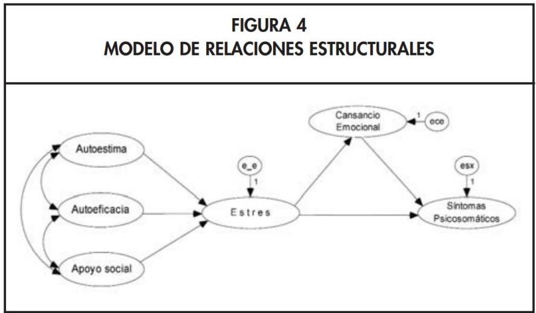
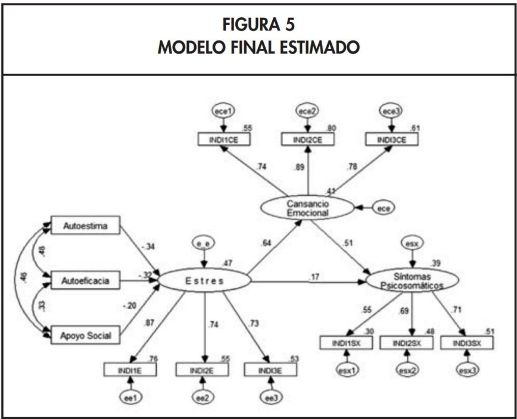
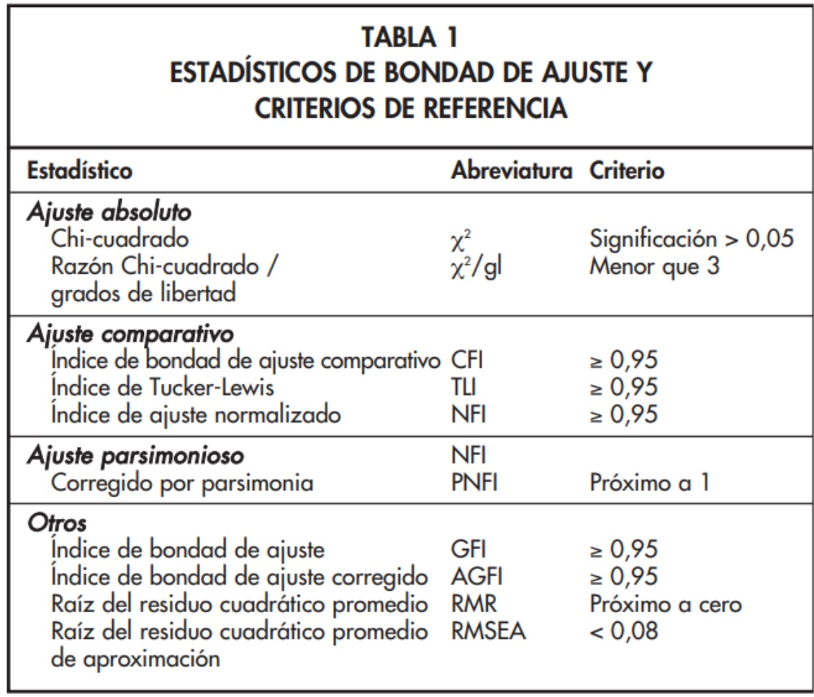

## Objetivos de la Sesión {.smaller}

-   **Comprender** qué son los Modelos de Ecuaciones Estructurales (SEM) y cómo integran las técnicas vistas anteriormente (AFC y Análisis de Senderos).
-   **Identificar** los componentes clave de un SEM: el modelo de medida y el modelo estructural.
-   **Reconocer** los distintos tipos de variables y relaciones que se pueden modelar.
-   **Entender** el proceso de especificación, estimación y evaluación de un modelo SEM.
-   **Conocer** los principales supuestos y los índices de ajuste utilizados para validar estos modelos.

---
title_slide_background: "#008080"
---

# 1. Modelos de Ecuaciones Estructurales (SEM)

## Introducción a los Modelos de Ecuaciones Estructurales {.smaller}

Los **Modelos de Ecuaciones Estructurales (SEM)** son una familia de modelos estadísticos multivariantes que representan la **culminación de las técnicas que hemos estudiado**, permitiendo estimar y testear complejas redes de relaciones entre múltiples variables.

-   Nacieron de la necesidad de superar las limitaciones de los modelos de regresión tradicionales.
-   Su principal ventaja es la flexibilidad: son menos restrictivos al permitir **modelar explícitamente el error de medición**, tanto en las variables que actúan como predictoras como en las que son predichas.

En resumen, los SEM nos permiten testear teorías sociológicas completas, que involucran tanto la medición de conceptos abstractos como las relaciones causales entre ellos.

## La Lógica "Confirmatoria" de los SEM {.smaller}

-   **Guiados por la Teoría:** Los SEM son de naturaleza **confirmatoria**, lo que significa que el investigador propone, *a priori*, una estructura que modela el tipo y dirección de las relaciones de interés, basándose en la teoría sociológica o en la literatura científica.
-   **Objetivo Principal:** El interés es evaluar si la estructura teórica propuesta es **consistente con** los datos empíricos observados en una muestra (lo que Kline denomina lógica de no-refutación), no "confirmar" de forma absoluta una verdad empírica.
-   **Base Empírica:** La estimación del modelo compara la **matriz de varianzas y covarianzas observada** contra la **matriz implicada** por las ecuaciones de nuestro modelo conceptual. Si la discrepancia entre ambas es mínima, consideramos que la teoría no es refutada por la evidencia empírica.

## Ejemplo de Aplicación en Salud {.smaller}

Imaginemos un modelo que busca explicar los **síntomas psicosomáticos**.

-   **Teoría:** Se postula que antecedentes personales como la **autoestima**, la **autoeficacia** y el **apoyo social** influyen en los síntomas, pero no solo directamente, sino también a través de variables intermedias como el **estrés** y el **cansancio emocional**.
-   **Análisis con SEM:** La estimación de los coeficientes de trayectoria (paths) nos permite evaluar estas asociaciones estadísticas. Podríamos constatar, por ejemplo, si el apoyo social se asocia negativamente con el estrés y si este último muestra una asociación positiva con los síntomas. El modelo nos permite cuantificar tanto efectos directos como indirectos de forma integrada.

{fig-align="center"}

## SEM e Inferencia Causal: Límites Metodológicos {.smaller}

**1. Consistencia no es Demostración Causal**:

-   Aunque los diagramas SEM utilizan flechas que representan hipótesis direccionales ("causales"), la obtención de un path significativo **no prueba la existencia de causalidad**.
-   Un buen ajuste global del modelo simplemente demuestra que la estructura de covarianzas empíricas de los datos es **compatible con la hipótesis del investigador**. No excluye la existencia de otras explicaciones plausibles.
-   La inferencia causal legítima exige, además de un ajuste estadístico satisfactorio, un sólido marco teórico sustantivo y, prioritariamente, un **diseño de investigación** fuerte (ej. datos longitudinales con precedencia temporal o diseños experimentales).

## SEM e Inferencia Causal: Modelos Equivalentes {.smaller}

**2. El Desafío de los Modelos Equivalentes (Kline, 2023)**:

-   En diseños de investigación transversales (cross-sectional), es estadísticamente muy común la presencia de **Modelos Equivalentes**.
-   Un modelo equivalente es una especificación alternativa del sistema (por ejemplo, invirtiendo la dirección de las flechas para simular **causalidad reversa**, o asumiendo variables latentes comunes omitidas) que produce exactamente la misma matriz de covarianza implicada.
-   Estadísticamente, el modelo original y el modelo equivalente **ajustan de forma idéntica** (tienen el mismo $\chi^2$, CFI y RMSEA). Por lo tanto, el ajuste matemático nunca puede resolver cuál es la dirección causal correcta; esa es una defensa eminentemente teórica y metodológica.

## Estructura de un Modelo SEM: Un Modelo de "Dos Partes" {.smaller}

Un modelo SEM completo se puede entender como la unión de dos sub-modelos que se estiman simultáneamente:

**1. Modelo de Medida:**

-   **Propósito:** Define cómo cada **constructo latente** se mide a través de sus **indicadores observables**.\
-   **Equivalencia:** Es, en esencia, un **Análisis Factorial Confirmatorio (AFC)**. Especifica qué ítems cargan en qué factores, permitiendo evaluar la validez y fiabilidad de nuestras mediciones al modelar explícitamente el error de cada indicador.

## Estructura de un Modelo SEM: Un Modelo de "Dos Partes" {.smaller}

**2. Modelo Estructural:**

-   **Propósito:** Define las **relaciones causales (paths) hipotetizadas entre los constructos** (generalmente, entre las variables latentes).\
-   **Equivalencia:** Es, en esencia, un **Análisis de Senderos (Path Analysis)**. Permite testear hipótesis sobre efectos directos e indirectos.

## Casos Especiales de SEM que ya conocemos {.smaller}

1.  **Análisis Factorial Confirmatorio (AFC):** Es un SEM que **solo contiene el modelo de medida**. Se enfoca en la calidad de la medición y las relaciones entre los factores son solo correlacionales, no direccionales.
2.  **Análisis de Senderos (Path Analysis):** Es un SEM que **no contiene variables latentes**; las variables observadas se tratan como si fueran mediciones perfectas de los conceptos (se equiparan las variables observadas con las latentes). Por lo tanto, solo existe el modelo estructural y los errores de medición se confunden con los errores de predicción en un único término de error para cada variable endógena.

## Tipos de Variables en un Modelo Estructural {.smaller}

::: {style="font-size: 0.9em; line-height: 1.2;"}
1.  **Variable Observada o Indicador:** Se mide directamente en los datos (ej. preguntas de un cuestionario).
2.  **Variable Latente (o Factor):** Constructo teórico que no se observa directamente y que el modelo asume está libre de error de medición. Se infiere a partir de sus indicadores.
3.  **Variable de Error:** Representa la varianza no explicada. Hay dos tipos:
    -   **Error de Medición:** Asociado a cada indicador, es la varianza de ese indicador que no es explicada por su factor latente.
    -   **Error Estructural (o Perturbación):** Asociado a cada variable *endógena* (latente u observada), es la varianza de esa variable que no es explicada por sus predictores en el modelo.
4.  **Variable Exógena:** Sus causas están fuera del modelo. No recibe flechas direccionales de ninguna otra variable en el modelo.
5.  **Variable Endógena:** Recibe al menos una flecha direccional. Su variación es (parcialmente) explicada por el modelo.
:::

## Diagramas Estructurales: Convenciones {.smaller}

**1. Representación de Variables:**

-   **Rectángulos:** Variables Observables (Indicadores).\
-   **Óvalos o Círculos:** Variables No Observables (Latentes, Errores).

**2. Representación de Relaciones:**

-   **Flechas Rectas Unidireccionales (**$\longrightarrow$): Efectos estructurales directos (regresión).\
-   **Flechas Curvas Bidireccionales (**$\longleftrightarrow$): Correlaciones o covarianzas no analizadas (generalmente entre variables exógenas o entre términos de error).\
-   **Parámetros:** Los coeficientes (cargas, paths) se pueden mostrar sobre las flechas.

**3. Término de Error:**

-   Cada variable **endógena** (latente u observada) debe tener un término de error asociado, representado por una flecha que apunta hacia ella.

## Ejemplo de un Modelo SEM Completo {.smaller}

:::::: columns
:::: {.column width="50%"}
::: {style="font-size: 0.9em; line-height: 1.2;"}
**Teoría del Modelo:**

-   **Constructos Latentes:** Autoestima, Autoeficacia, Apoyo Social (exógenos); Estrés, Cansancio Emocional, Síntomas Psicosomáticos (endógenos).
-   **Modelo Estructural (Fig. 4):** Hipotetiza las relaciones causales entre los constructos.
-   **Modelo de Medida (Fig. 5):** Cada constructo se mide a través de tres indicadores observables (ej. `INDI1CE`, `INDI2CE`, `INDI3CE` para Cansancio Emocional).
-   **Modelo Final (Fig. 5):** Integra ambas partes, permitiendo analizar las relaciones entre los constructos mientras se controla el error de medición.
:::
::::

::: {.column width="50%"}
**Figura 4: Modelo Estructural** 
:::
::::::

## Ejemplo de un Modelo SEM Completo {.smaller}

{width="600"}

*Figura 5: Modelo Final Estimado (con modelo de medida)*

## Tipos de Relaciones en SEM {.smaller}

Los SEM nos permiten explorar una rica variedad de relaciones entre variables:

1.  **Covariación vs Causalidad:** Distinguir entre mera asociación y relaciones direccionales hipotetizadas.
2.  **Relación Espuria:** Identificar cuando la correlación entre dos variables se debe a una causa común.
3.  **Relación "Causal" Directa e Indirecta:** Descomponer el efecto total, identificando mecanismos de mediación.
4.  **Relación "Causal" Recíproca:** Modelar bucles de retroalimentación (feedback loops).
5.  **Efectos Totales:** La suma de los efectos directos e indirectos.

## Supuestos de los Modelos de Ecuaciones Estructurales {.smaller}

-   **Tamaño de muestra suficientemente grande:** Mínimo 200, pero idealmente 10-20 casos por parámetro a estimar.
-   **Relaciones lineales** entre las variables.
-   **Normalidad multivariante** (importante para el método de estimación ML).
-   **Identificación del modelo** (grados de libertad \> 0).
-   **Ausencia de multicolinealidad** entre predictores.
-   **Variables continuas** (o uso de estimadores apropiados para categóricas como DWLS).

---
title_slide_background: "#008080"
---

# Pasos de un Modelo de Ecuaciones Estructurales

## Paso 1: Especificación del Modelo {.smaller}

1.  **Base Teórica:** La teoría que respalda el modelo debe estar formulada de tal manera que pueda ser probada con datos reales. Se deben incluir todas las variables consideradas teóricamente importantes.
2.  **Definir Relaciones:** Especificar las relaciones esperadas entre todas las variables: correlaciones entre exógenas, efectos directos (paths) en el modelo estructural, y qué indicadores miden qué factores en el modelo de medida.
3.  **Formular en Diagrama:** Dibujar el modelo teórico en un formato gráfico. Esto ayuda a visualizar, clarificar y traducir las hipótesis en las ecuaciones y parámetros que el software estimará.

## Paso 2: Identificación del Modelo {.smaller}

-   Al igual que en el análisis de senderos, debemos asegurarnos que contamos con **información suficiente para estimar el modelo**.
-   Cada parámetro debe estar correctamente identificado y ser derivable de la información en la **matriz de varianzas-covarianzas** de las variables observadas.
-   Debemos revisar que los **grados de libertad (gl) sean mayores a 0**, lo que indica un modelo sobreidentificado y testeable.
-   **Estrategias para garantizar la identificación:** usar al menos tres indicadores por variable latente; fijar la métrica de cada variable latente (ej. fijando una carga a 1 o la varianza del factor a 1).

## Paso 3: Estimación del Modelo {.smaller}

1.  Se estiman los parámetros del modelo (cargas factoriales, coeficientes de trayectoria o paths, varianzas de error y perturbaciones) a partir del modelo especificado.
2.  **Métodos de Estimación y Naturaleza de las Variables (Kline, 2023)**:
    -   **Máxima Verosimilitud (ML/MLR)**: Es el método estándar por defecto en `{lavaan}`. Asume que las variables indicadoras son continuas y siguen una distribución normal multivariante (MLR provee errores estándar robustos ante la no-normalidad).
    -   **Mínimos Cuadrados Ponderados Diagonales (DWLS/WLSMV)**: Constituye el estándar metodológico moderno cuando el modelo de medida incluye indicadores que son estrictamente **ordinales o categóricos** (como ítems Likert de 4 o 5 categorías). Modela las matrices de **correlaciones policóricas** subyacentes, evitando los sesgos severos que introduce tratar variables ordinales como si fueran continuas.

## Paso 4: Evaluación de Ajuste {.smaller}

1.  **Valorar el ajuste del modelo:** Evaluamos qué tan bien las estimaciones obtenidas reproducen la matriz de varianzas-covarianzas observada en los datos empíricos.
2.  **Doble Desafío en SEM:** Un buen ajuste en SEM requiere que **tanto el modelo de medición (AFC) como el modelo estructural (paths) se ajusten bien a los datos de forma simultánea**, lo que constituye una prueba altamente exigente.
3.  **Perspectiva del Ajuste de Dos Niveles (Kline, 2023)**:
    -   **Ajuste Global**: Índices que resumen la discrepancia media del modelo.
    -   **Ajuste Local**: Análisis detallado de las discrepancias específicas entre pares de variables (residuos). Es el paso definitivo, ya que un buen ajuste global promedio puede ocultar errores graves y localizados.

## Estadísticos de Bondad de Ajuste {.smaller}

::::: columns
::: {.column width="50%"}
Se utilizan tres tipos de estadísticos como **heurísticos y guías orientativas** aproximadas (no como leyes o reglas de corte rígidas):

-   **Ajuste Absoluto:** Valoran la reproducción directa de los datos sin un modelo comparativo de referencia (ej. $\chi^2$, RMSEA).
-   **Ajuste Relativo (Incremental):** Comparan el ajuste del modelo propuesto contra un modelo de independencia o nulo (ej. CFI, TLI).
-   **Ajuste Parsimonioso:** Penalizan la complejidad y cantidad de parámetros libres estimados (ej. AIC, BIC).

Se debe reportar un conjunto de índices de diferentes tipos para una evaluación robusta.
:::

::: {.column width="50%"}
 *(Tabla de referencia con criterios comunes, entendidos como guías flexibles)*
:::
:::::

## Chi Cuadrado ($\chi^2$) {.smaller}

-   Es el estadístico más fundamental, ya que contrasta la hipótesis nula de que el modelo se ajusta perfectamente a los datos poblacionales (todos los errores del modelo son nulos).
-   Sin embargo, es **extremadamente sensible al tamaño de la muestra**: con muestras grandes (N \> 200-400), es muy probable que resulte significativo (p \< 0.05), llevando a rechazar modelos que en la práctica representan de forma muy razonable a los datos.
-   Por lo tanto, se debe informar siempre este estadístico pero contrastándolo críticamente con los grados de libertad y complementándolo con otros heurísticos globales y con la evaluación local.

## Evaluación del Ajuste Local: La Matriz de Residuos {.smaller}

-   **La Limitación del Ajuste Global**: Un modelo puede tener un CFI \> 0.95 y un RMSEA \< 0.05 (sugiriendo un excelente ajuste general), pero al mismo tiempo predecir de forma muy deficiente la covarianza entre un par específico de variables clave.
-   **La Solución (Local Fit)**: Examinar la **Matriz de Residuos de Correlación** (o covarianza). 
-   **Interpretación de Residuos (Kline, 2023)**:
    -   Cada residuo representa la diferencia entre la correlación observada y la implicada por el modelo para un par de variables indicadoras.
    -   Buscamos que los residuos sean lo más cercanos a 0 posible.
    -   Valores residuales absolutos superiores a **$|0.10|$** indican una falla de ajuste localizada de importancia diagnóstica (ej. una relación teórica omitida o una redundancia de medición no modelada).

## Paso 5: Re-especificación {.smaller}

-   Si el modelo presenta un ajuste insatisfactorio (global y/o local), se pueden introducir modificaciones (agregar o quitar parámetros).
-   Este proceso debe ser guiado por los **índices de modificación** y el análisis de los **residuos**, pero **siempre justificado por la teoría**.
-   Los cambios propuestos deben ser coherentes con el marco conceptual. No se debe "cazar el ajuste" a costa del sentido teórico.

## Paso 6: Interpretación de Resultados {.smaller}

-   **Coeficientes Beta Estandarizados:** Se interpretan de manera análoga a la regresión múltiple. Representan el cambio en desviaciones estándar en la variable dependiente por un cambio de una DE en la predictora, controlando por las demás variables del sistema.
-   **Significación de cada coeficiente:** Se evalúa con el p-valor (usualmente p \< 0.05) para determinar si el efecto estimado es significativamente diferente de cero.
-   **R-cuadrado (**$R^2$): Representa el porcentaje de la varianza en cada **variable endógena** (tanto latente como observada) que es explicado por sus predictores en el modelo estructural.
-   **Atención al Doble Papel:** En SEM, los coeficientes describen tanto el **modelo de medición** (cargas) como el **modelo estructural** (paths). Es crucial interpretar ambos niveles para una comprensión completa del modelo.
